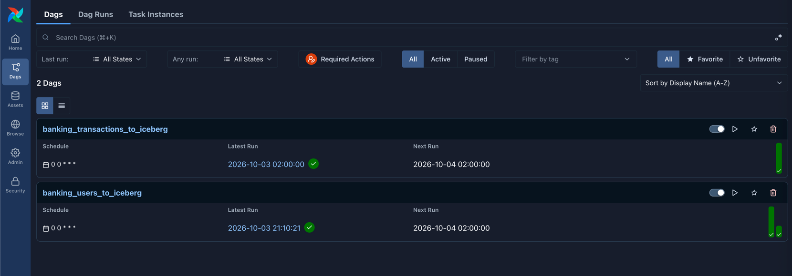
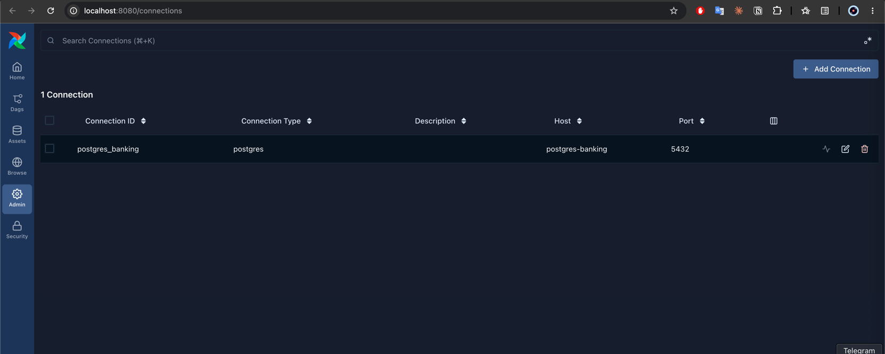

# Postgres to Iceberg Pipeline

A data ingestion pipeline that leverages the [Astronomer Blueprint](https://github.com/astronomer/blueprint) library to extract tables from PostgreSQL and load them into Apache Iceberg tables stored in S3-compatible storage (MinIO).

Pipelines are declared as `*.dag.yaml` files; a loader turns each one into an
Airflow DAG backed by the reusable Postgres→Iceberg blueprint.

## Features

- **Declarative DAG Configuration**: Define your data pipelines using simple YAML files
- **Reusable Blueprint Pattern**: Custom blueprint for Postgres-to-Iceberg ingestion that can be applied to any table
- **Full Docker Stack**: Complete environment with Airflow, PostgreSQL, and MinIO (S3-compatible storage)
- **Apache Iceberg Destination**: Modern table format with ACID guarantees and time travel capabilities
- **Persistent Iceberg Catalog**: REST catalog backed by Postgres, so tables survive `docker compose down`
- **Scalable Architecture**: Batch processing with configurable chunk sizes

## Architecture

```
   SOURCE                 ORCHESTRATION                  DESTINATION (Apache Iceberg)
┌──────────────┐        ┌──────────────┐           ┌──────────────────────────────────┐
│  PostgreSQL  │        │   Airflow    │           │                                  │
│  postgres-   │──────> │  + Blueprint │─────────> │  ┌────────────────────────────┐  │
│  banking     │ extract│              │  write    │  │ iceberg-rest  (catalog)    │  │
│  :5432 (5433)│        │  scheduler   │           │  │ :8181  REST API            │  │
│              │        │  api-server  │ ────────> │  │   ├─ banking.users         │  │
│  6 tables    │        └──────┬───────┘  commit   │  │   └─ banking.transactions  │  │
└──────────────┘               │                   │  └─────────────┬──────────────┘  │
                               │                   │                │ JDBC            │
                               │                   │  ┌─────────────▼──────────────┐  │
                        ┌──────▼───────┐           │  │ postgres-catalog  :5434    │  │
                        │  postgres    │           │  │ table pointers (dedicated) │  │
                        │  (metadata)  │           │  └────────────────────────────┘  │
                        │  :5432       │           │                                  │
                        └──────────────┘           │  ┌────────────────────────────┐  │
                                                   │  │ MinIO  s3://iceberg-       │  │
                                                   │  │ warehouse/warehouse/       │  │
                                                   │  │ data + manifests + metadata│  │
                                                   │  └────────────────────────────┘  │
                                                   └──────────────────────────────────┘
```

An Iceberg table is two things, stored separately:

| Layer | Lives in | Survives restart? |
|---|---|---|
| **Catalog** — namespace/table → current metadata pointer | `postgres-catalog`, a dedicated Postgres, via `iceberg-rest` | Yes (`postgres_catalog_data` volume) |
| **Table data** — Parquet files, manifests, metadata JSON | MinIO, `s3://iceberg-warehouse/warehouse/` | Yes (`minio_data` volume) |

The catalog is reached over **REST** rather than PyIceberg's SQL catalog. Airflow 3 is itself on `sqlalchemy>=2.0`, so the old version conflict is gone, but running the catalog as its own service still keeps catalog dependencies and the JDBC driver out of the Airflow image entirely.

### Where things run

Everything above runs **locally in Docker Compose** — Airflow, both Postgres
instances, MinIO, and the Iceberg REST catalog. There is no cloud dependency.

## Project Structure

```
airflow-blue-print-project /
├── airflow/                        # Airflow-related files
│   ├── blueprints/                # Custom Blueprint implementations
│   │   ├── __init__.py
│   │   └── postgres_to_iceberg.py # Postgres to Iceberg blueprint
│   ├── dags/                      # YAML DAG definitions + loader
│   │   ├── loader.py              # Builds Airflow DAGs from the YAML files
│   │   ├── dag_args.py            # Project-wide DAG argument template
│   │   └── *.dag.yaml             # One file per pipeline
│   ├── config/                    # Configuration files
│   │   └── airflow_connections.sh # Script to setup Airflow connections
│   ├── lib/                       # Custom Python libraries
│   ├── tasks/                     # Custom task implementations
│   └── requirements.txt           # Python dependencies for Airflow
├── banking-app/                    # Banking application (source database)
│   ├── init-scripts/              # Banking database schema
│   │   └── 02-init-banking-schema.sql  # all six tables
│   ├── scripts/                   # Data generation tools
│   │   ├── generate_banking_data.py  # populates all six tables
│   │   └── README.md              # Generator documentation
│   ├── requirements.txt           # Python dependencies
│   └── README.md                  # Banking app documentation
├── docker-compose.yml     # All Docker services (Airflow + Postgres + MinIO + Iceberg REST)
├── Makefile                       # make help
├── pyproject.toml                 # Project configuration
└── README.md
```

## Make commands

The Makefile is the shortest path to everything below.

```bash
make help            # list every target
```

| Target | Does |
|---|---|
| `make docker-up` | Start the stack (Airflow, Postgres, MinIO, Iceberg REST) |
| `make docker-down` | Stop it |
| `make docker-logs` | Follow service logs |
| `make seed-data` | Recreate the schema and populate all six source tables |

A full first run:

```bash
make docker-up      # wait ~60s for health checks
make seed-data
```

Then trigger a DAG from the Airflow UI — see [Trigger the Pipeline](#4-trigger-the-pipeline).

## Quick Start

### Prerequisites

- Docker & Docker Compose
- Python 3.11+
- At least 4GB RAM available for Docker

### 1. Setup

```bash
# Navigate to project directory
cd airflow-blueprint
```

Configuration lives in `.env` (copy `.env.example` if you have none). The
defaults work as-is. Two settings are worth understanding:

```bash
AIRFLOW_UID=50000                      # owns files on the bind mounts
AIRFLOW__CORE__FERNET_KEY=<stable key> # or saved connections become undecryptable
```

`AIRFLOW_UID` is the UID that owns files on the bind mounts (`logs/`,
`airflow/plugins/`). `50000` is the `airflow` user baked into the image and is a
safe default everywhere. On Linux, setting it to your own `id -u` avoids
root-owned files on those mounts; upstream recommends that, and a UID with no
`/etc/passwd` entry works fine because the image's entrypoint adds one
dynamically. The `airflow-init` service runs as root solely to `chown` the
mounted directories to this UID before the other services start.

`AIRFLOW__CORE__FERNET_KEY` must stay stable across restarts; if it changes,
previously saved connection passwords can no longer be decrypted. Generate one
with:

```bash
python -c "from cryptography.fernet import Fernet; print(Fernet.generate_key().decode())"
```

### 2. Start the Services

```bash
# Start all services
make docker-up-build

# Wait for services to be healthy
make docker-ps
```

`airflow-init` runs first (DB migration, admin user, directory ownership) and the
other services wait for it to complete. Expect the **first** start to take a few
minutes: every Airflow container pip-installs `_PIP_ADDITIONAL_REQUIREMENTS` on
each boot — see [Python dependencies](#python-dependencies).

The `postgres_banking` connection is created by the one-shot `airflow-connections`
service, so no manual `airflow connections add` is needed.

Services will be available at:

| Service | Address | Credentials |
|---|---|---|
| Airflow UI | http://localhost:8080 | `_AIRFLOW_WWW_USER_USERNAME` / `_AIRFLOW_WWW_USER_PASSWORD` from `.env` (default `airflow` / `airflow`) |
| MinIO Console | http://localhost:9001 | `minioadmin` / `minioadmin` |
| Iceberg REST catalog | http://localhost:8181 | — |
| Source PostgreSQL (`bankingdb`) | localhost:**5433** | `bankinguser` / `bankingpass` |
| Metadata PostgreSQL (`airflow`) | localhost:**5432** | `airflow` / `airflow` |
| Catalog PostgreSQL (`iceberg_catalog`) | localhost:**5434** | `iceberg` / `iceberg` |

Note the two Postgres instances are on **different host ports**. Connecting a SQL
client to 5432 with `bankinguser` hits the metadata database instead and fails with
`password authentication failed for user "bankinguser"` — use **5433** for source data.

### 3. Verify Setup

The Postgres source connection is automatically created during initialization. Verify it in the Airflow UI:

1. Open http://localhost:8080

2. Go to Admin > Connections
3. Look for `postgres_banking` connection

### 4. Trigger the Pipeline

1. Open Airflow UI at http://localhost:8080
2. Find a DAG — `banking_users_to_iceberg`, `banking_transactions_to_iceberg`,
   or any you generated
3. Toggle it to "Active" (if not already)
4. Click "Trigger DAG" to start the pipeline

Verify the result in the Iceberg catalog:

```bash
curl -s http://localhost:8181/v1/namespaces/banking/tables | jq
```

> **Note:** `airflow/requirements.txt` is baked into the image at build time, so
> dependencies survive a container recreate. Rebuild after editing it — see
> [Python dependencies](#python-dependencies).

## Blueprint Configuration

The `PostgresToIcebergBlueprint` accepts the following configuration:

```yaml
config:
  table_name: users              # Source table name (required)
  schema_name: public            # Postgres schema (default: "public")
  iceberg_namespace: banking     # Iceberg namespace/database (default: "default")
  iceberg_table_name: users      # Iceberg table name (defaults to table_name)
  s3_bucket: iceberg-warehouse   # S3 bucket name (default: "iceberg-warehouse")
  s3_prefix: warehouse           # S3 prefix/path (default: "warehouse")
  mode: overwrite                # Write mode: "overwrite" or "append" (default: "overwrite")
  batch_size: 10000              # Rows per batch (default: 10000)
  postgres_conn_id: postgres_banking  # Airflow connection ID (default: "postgres_banking")
```

## Creating Custom DAGs

Create a new file in `airflow/dags/` named `*.dag.yaml` — `loader.py` discovers
that glob and builds the DAGs; a file named `*.yml` is silently ignored.

```yaml
---
dag_id: my_custom_pipeline
description: "My custom data pipeline"
schedule: "@daily"
start_date: "2024-01-01"
catchup: false

steps:
  ingest_my_table:                          # step id is the key
    blueprint: postgres_to_iceberg_blueprint  # snake_case of the class name
    table_name: my_table                    # blueprint config is flat
    schema_name: public
    iceberg_namespace: my_namespace
    mode: overwrite

  ingest_another_table:
    blueprint: postgres_to_iceberg_blueprint
    depends_on:
      - ingest_my_table
    table_name: another_table
    iceberg_namespace: my_namespace
```

Schema notes, since these are easy to get wrong:

- `steps` is a **mapping** keyed by step id, not a list of `- id:` entries
- `blueprint` is the blueprint's **snake_case name** as a string, not a
  `name`/`path` object
- Blueprint config keys sit **flat on the step**, not nested under `config:`
- Use `schedule`, not `schedule_interval`
- Top-level DAG keys are limited to what `dags/dag_args.py` declares — add a field
  there before using it in YAML

## Sample Data

### Banking Application Data

For more realistic testing, use the banking data generator:

```bash
# Navigate to banking-app directory
cd banking-app

# Install dependencies
pip install -r requirements.txt

# Generate 1000 users with ~5 transactions each
python scripts/generate_banking_data.py \
  --users 1000 \
  --transactions 5 \
  --host localhost \
  --port 5433

# With reproducible seed
python scripts/generate_banking_data.py \
  --users 500 \
  --transactions 8 \
  --seed 42
```

Or generate everything in one step:

```bash
make seed-data
```

The source database has six tables:

| Table | Holds | Notable types |
|---|---|---|
| `users` | Customers and their primary account | PII: `ssn`, `email`, `date_of_birth` |
| `transactions` | Transaction history | `numeric(15,2)` money columns |
| `accounts` | Normalised accounts, several per user | `real`, `double precision`, `timestamptz` |
| `merchants` | Transaction counterparties | `uuid`, `text[]`, `jsonb` |
| `loans` | Lending book | `interval`, `time`, `numeric(5,3)` |
| `audit_log` | Append-only action trail | `uuid`, `inet`, `bytea`, `jsonb` |

The last four exist partly to exercise the Iceberg blueprint's type mapping.
It maps a fixed list of Postgres types and silently falls back to `StringType`
for anything else, so `uuid`, `jsonb`, `text[]`, `interval`, `inet` and `bytea`
make that behaviour observable rather than
theoretical. `audit_log` is append-only, so it is the natural table for testing
`mode: append` against the blueprint's default `overwrite`.

See `banking-app/README.md` for detailed documentation.

### Connect to Database

```bash
docker exec -it postgres-banking psql -U bankinguser -d bankingdb

# List tables
\dt

# Query banking data (after running generator)
SELECT account_type, COUNT(*) FROM users GROUP BY account_type;
SELECT transaction_type, COUNT(*) FROM transactions GROUP BY transaction_type;
```

## The Iceberg Destination

The pipeline writes **Apache Iceberg** tables. The banking DAG produces:

| Iceberg table | Source table | Warehouse location |
|---|---|---|
| `banking.users` | `bankingdb.public.users` | `s3://iceberg-warehouse/warehouse/banking/users/` |
| `banking.transactions` | `bankingdb.public.transactions` | `s3://iceberg-warehouse/warehouse/banking/transactions/` |

### Querying with PyIceberg

```python
from pyiceberg.catalog import load_catalog

catalog = load_catalog(
    "default",
    **{
        "type": "rest",
        # Host-side the REST catalog is on localhost:8181.
        # Inside the compose network use http://iceberg-rest:8181
        "uri": "http://localhost:8181",
        "warehouse": "s3://iceberg-warehouse/warehouse",
        "s3.endpoint": "http://localhost:9000",
        "s3.access-key-id": "minioadmin",
        "s3.secret-access-key": "minioadmin",
    }
)

print(catalog.list_namespaces())          # [('banking',)]
print(catalog.list_tables("banking"))     # [('banking', 'users'), ...]

table = catalog.load_table("banking.users")
df = table.scan().to_pandas()
print(df.head())
```

Requires `pip install 'pyiceberg[s3fs,pyarrow]'` on the host. Do **not** add the
`sql-postgres` extra — see [Iceberg catalog](#iceberg-catalog) below.

### Time travel

Iceberg keeps every snapshot, so you can read the table as of any earlier commit:

```python
table = catalog.load_table("banking.users")

for snap in table.snapshots():
    print(snap.snapshot_id, snap.timestamp_ms, snap.summary.get("operation"))

# read an earlier snapshot
old = table.scan(snapshot_id=table.snapshots()[0].snapshot_id).to_pandas()
```

### Inspecting the REST catalog directly

```bash
# namespaces
curl -s http://localhost:8181/v1/namespaces | jq

# tables in a namespace
curl -s http://localhost:8181/v1/namespaces/banking/tables | jq

# the catalog's own state, in Postgres
docker exec postgres-catalog psql -U iceberg -d iceberg_catalog \
  -c "SELECT table_namespace, table_name FROM iceberg_tables;"
```

### Browsing the files in MinIO

1. Open http://localhost:9001 and log in with `minioadmin` / `minioadmin`
2. Open the `iceberg-warehouse` bucket, then `warehouse/banking/<table>/`
3. `data/` holds Parquet files; `metadata/` holds the manifests and metadata JSON

### Iceberg catalog

The catalog is the `iceberg-rest` service (`apache/iceberg-rest-fixture`), storing
table pointers in **`postgres-catalog`** — a Postgres instance dedicated to the
catalog, with its own `postgres_catalog_data` volume — so tables survive a full
`docker compose down && up`.

It is deliberately *not* the Airflow metadata database. Keeping them apart means
Airflow maintenance and the catalog have independent lifecycles: resetting or
restoring Airflow's database cannot orphan the Iceberg tables in MinIO, and the
catalog can be backed up on its own.

Two details are worth knowing if you edit the compose file:

- **The fixture image bundles no JDBC drivers.** The `iceberg-rest-init` service
  downloads the Postgres driver into the shared `jdbc_drivers` volume first.
- **`java -jar` ignores `-cp`.** The service therefore overrides the entrypoint to
  invoke the main class explicitly with the driver on the classpath.

Switch catalogs by setting `ICEBERG_CATALOG_URI` in `.env` (default
`http://iceberg-rest:8181`).

## Monitoring and Debugging

### View Airflow Logs

```bash
# Scheduler logs
docker logs -f airflow-scheduler

# API server logs (the UI and REST API; replaces the 2.x webserver)
docker logs -f airflow-apiserver

# DAG processor logs - DAG parsing errors show up here, not in the scheduler
docker logs -f airflow-dag-processor

# Task logs are available in the Airflow UI
```

### Check Service Health

```bash
# View all services status
docker compose ps

# Check specific service
docker exec postgres-banking pg_isready -U bankinguser
```

## Development

### Adding a New Blueprint

1. Create a new Python file in `airflow/blueprints/`
2. Define your Blueprint class with a `config_class` and `render()` method
3. Use the blueprint in your YAML DAG configuration

Blueprints are discovered from `airflow/blueprints/` at runtime, so there is no
registry list to update.

### Modifying the Pipeline

Edit `airflow/blueprints/postgres_to_iceberg.py` to customize:
- Data type mapping
- Schema inference logic
- Error handling
- Performance optimizations

### Testing

```bash
# List the DAGs that were built from the YAML
docker exec airflow-apiserver airflow dags list

# Show why a DAG file failed to parse
docker exec airflow-dag-processor airflow dags list-import-errors

# Run a DAG end to end, in-process. In Airflow 3 this takes no date argument;
# it uses the current time as the logical date.
docker exec airflow-apiserver airflow dags test banking_users_to_iceberg
```

> `blueprint lint` does not work in this project. The CLI only discovers
> blueprints inside the DAGs directory, while this project keeps them in the
> sibling `airflow/blueprints/` (which is exactly why `loader.py` points the
> registry at both directories). Running it from `/opt/airflow` additionally
> trips a recursion guard, because `logs/` is mounted inside the Airflow home.
> Use `airflow dags list` / `list-import-errors` to validate instead.

## Cleanup

```bash
# Stop all services
docker compose down

# Remove volumes (CAUTION: deletes all data)
docker compose down -v

# Remove only specific volumes
docker volume rm airflow-blue-print-project_postgres_banking_data
docker volume rm airflow-blue-print-project_minio_data
```

Volumes in this stack:

| Volume | Holds |
|---|---|
| `postgres_banking_data` | Source banking data |
| `postgres-db-volume` | Airflow metadata (named per the upstream reference file) |
| `postgres_catalog_data` | Iceberg catalog (table pointers) |
| `minio_data` | Iceberg table files |
| `jdbc_drivers` | Postgres JDBC driver for the REST catalog |

Airflow logs and plugins are **bind mounts** (`./logs`, `./airflow/plugins`), not
named volumes, matching the upstream reference file — task logs are readable
directly on the host.

Dropping `postgres_catalog_data` deletes the Iceberg **catalog** while leaving the
data files in MinIO — the tables become unreachable even though the Parquet is
intact. Drop it together with `minio_data`, or neither.

## Python dependencies

Following the official reference compose file, extra dependencies are installed
through `_PIP_ADDITIONAL_REQUIREMENTS`, declared in `x-airflow-common` in
`docker-compose.yml`. The list mirrors `airflow/requirements.txt`.

`apache-airflow-providers-fab` is required rather than optional:
`AIRFLOW__CORE__AUTH_MANAGER` resolves `FabAuthManager` from it, and the init
container's user creation needs its `airflow users` CLI.

**These packages are reinstalled on every container start.** That costs startup
time and needs network access on each boot. Upstream is explicit that this is a
quick-check feature only; the durable alternative is an extended image, and
`airflow/Dockerfile` is set up for it — see the switch-over steps in that file.

After changing the dependency list, recreate the containers:

```bash
docker compose up -d --force-recreate
```

## Tech Stack

- **Apache Airflow 3.3.2**: Workflow orchestration (LocalExecutor; provisioning derived from the [official reference compose file](https://airflow.apache.org/docs/apache-airflow/3.3.2/docker-compose.yaml))
- **Astronomer Blueprint**: DAG templating framework
- **PostgreSQL 15**: Source database
- **Apache Iceberg**: Table format (ACID commits, snapshots, time travel)
- **Iceberg REST catalog**: `apache/iceberg-rest-fixture`, JDBC-backed by Postgres
- **MinIO**: S3-compatible object storage (pulled from `quay.io/minio`)
- **PyIceberg**: Python client for Iceberg (REST catalog)
- **PyArrow**: Columnar data processing

## References

- [Astronomer Blueprint Documentation](https://github.com/astronomer/blueprint)
- [Apache Iceberg Documentation](https://iceberg.apache.org/)
- [Apache Airflow Documentation](https://airflow.apache.org/)
- [MinIO Documentation](https://min.io/docs/minio/linux/index.html)
- [Iceberg REST Catalog spec](https://github.com/apache/iceberg/blob/main/open-api/rest-catalog-open-api.yaml)
- [PyIceberg Documentation](https://py.iceberg.apache.org/)

## License

This project is for educational purposes.